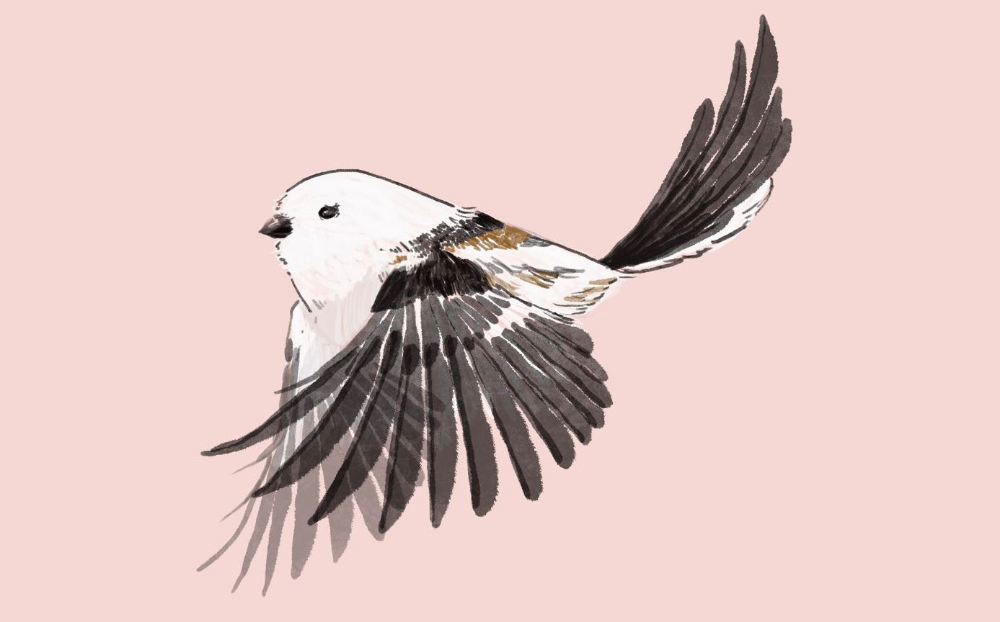

I travelled with my parents everywhere when I was a child. That is the reason I love nature so much and always want to be engaged in contributing to a better environment. Design is one of the methods and it is fun. To better understand a place better, it is needed to study it first deeply. To fulfil the stakeholders' demands, it is needed to communicate with different people. To solve the existing problems and create a better environment, it is needed to develop a range of solutions. In the end, it is needed to turn the design into reality.  

## [Ecological Park Design]{:.heading.flip-title}
Bring wild lives back to the city
{:.lead width="800" height="500" loading="lazy"}

## [University Campus Planning and Design --- GTSI]{:.heading.flip-title}
ONGOING PROJECT under AUBE
Georgia Tech Shenzhen Institute, Tianjin University

## [Animal Study Project]{:.heading.flip-title}
Animals are critical to creating a better living environment for us as well.
{:.lead width="800" height="500" loading="lazy"}

[Ecological Park Design]: ecological_park.md
[University Campus Planning and Design --- GTSI]: gtsi.md
[Animal Study Project]: animals.md
