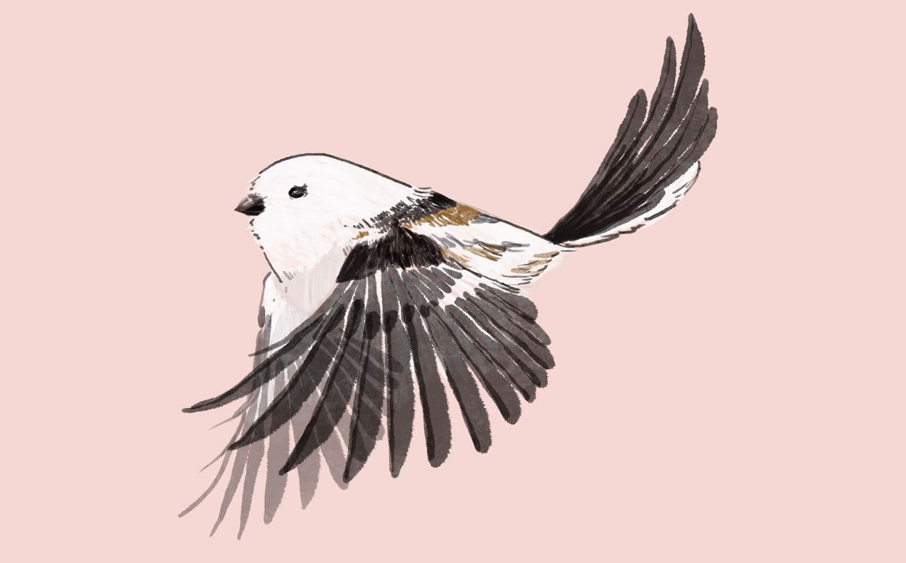

**Long-tailed tit**

Long-tailed tits are very lovely birds, which are also friendly and possible to be found near human settlements. They are common in the North of China and the North of European. They have a very unique way of rising the chicks, which is called cooperative breeding. That means that they would help to rise chicks that are not their own offspring.

{:.lead width="800" height="500" loading="lazy"}

This drawing I made is also posted by [THE ETHOGRAM](https://theethogram.com/), the Blog of UC Davis Animal Behavior Graduate Groups. Here is [the link to the blog about the long-tailed tit](https://theethogram.com/2023/04/09/sunday-sketch-the-long-tailed-tit/)

{:.lead width="800" height="500" loading="lazy"}
